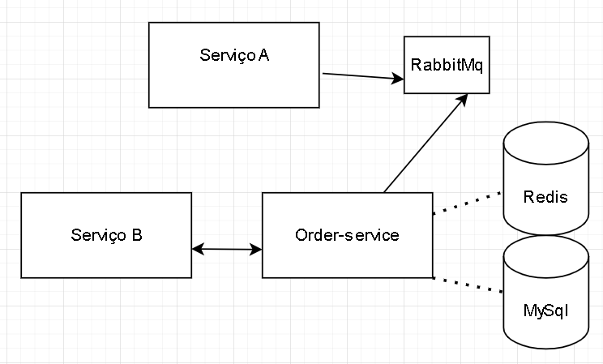

# Service Order - Sistema de Gerenciamento de Pedidos

## Visão Geral
O projeto **Service Order** é um serviço backend responsável por gerenciar e processar pedidos de clientes. O sistema recebe pedidos de um sistema externo (Produto A), calcula o valor total e fornece os pedidos processados a outro sistema externo (Produto B). A solução garante escalabilidade, alta disponibilidade e desempenho para processar grandes volumes de pedidos.

## Arquitetura


O sistema segue uma arquitetura de microsserviços e inclui os seguintes componentes:

- **Aplicação Spring Boot (Order Service):** Lida com o processamento e a lógica de negócios dos pedidos.
- **RabbitMQ:** Broker de mensagens assíncronas para recebimento de pedidos do Produto A.
- **Banco de Dados MySQL:** Armazenamento persistente para registros de pedidos.
- **Redis Cache:** Solução de cache para otimizar a recuperação de pedidos.
- **Nginx Load Balancer:** Distribui a carga entre múltiplas instâncias.
- **Docker Compose:** Configuração de ambiente conteinerizado.
- **Spring Boot Actuator:** Monitoramento e verificações de integridade.

### Fluxo do Sistema
1. Os pedidos são recebidos do **Produto A** via RabbitMQ.
2. O Order Service processa os pedidos, calcula o preço total e os salva no MySQL.
3. Pedidos frequentemente acessados são armazenados em cache no Redis para melhor desempenho.
4. Pedidos processados são disponibilizados via API REST para o **Produto B.**

## Funcionalidades
- **Gerenciamento de Pedidos:** Criar, atualizar e excluir pedidos.
- **Paginação e Ordenação:** Recuperação eficiente de pedidos.
- **Tratamento de Concorrência:** Garante consistência de dados sob alta carga.
- **Caching:** Melhora o tempo de resposta utilizando Redis.
- **Escalabilidade:** Balanceamento de carga com Nginx e múltiplas instâncias do serviço.
- **Observabilidade:** Logs com SLF4J e monitoramento via Actuator.

## Pré-requisitos
Certifique-se de ter instalado:
- Docker e Docker Compose
- Java 21
- Maven ou Gradle

## Início Rápido
### Clonar o Repositório
```bash
git clone https://github.com/your-repo/service-order.git
cd service-order
```

### Executando a Aplicação
Para iniciar todo o sistema usando Docker Compose:
```bash
docker-compose up -d --build
```

### Acessando a Aplicação
- **Swagger UI:** [http://localhost/swagger-ui.html](http://localhost/swagger-ui.html)
- **Verificação de Saúde (Actuator):** [http://localhost:8080/actuator/health](http://localhost:8080/actuator/health)
- **Obs:** Use "/v3/api-docs" no campo explore
### Variáveis de Ambiente
A aplicação requer as seguintes variáveis de ambiente:
```yaml
spring:
  datasource:
    url: jdbc:mysql://localhost:3306/order_db?createDatabaseIfNotExist=true
    username: root
    password: root
  rabbitmq:
    host: localhost
    port: 5672
    username: guest
    password: guest
```

## Endpoints da API
### Gerenciamento de Pedidos

| Método HTTP | Endpoint           | Descrição                  |
|-------------|-------------------|-----------------------------|
| POST        | /order             | Criar um novo pedido         |
| PUT         | /order/{id}/status | Atualizar o status do pedido |
| GET         | /order/{id}        | Obter pedido por ID          |
| GET         | /order             | Obter todos os pedidos       |
| DELETE      | /order/{id}        | Excluir um pedido            |

## Monitoramento e Logs
- **Spring Boot Actuator:** Fornece insights sobre a integridade e desempenho da aplicação.
- **slf4j:** Configurado para logs estruturados em formato JSON.

## Testes
Para rodar os testes:
```bash
./gradlew test
```

## Escalando a Aplicação
Para escalar o serviço:
```bash
docker-compose up --scale service-order=2
```

## Contribuidores
- [Lucas Sant Anna Barbosa](https://github.com/LsaBarbosa)

## Licença
Este projeto é licenciado sob a Licença MIT.

